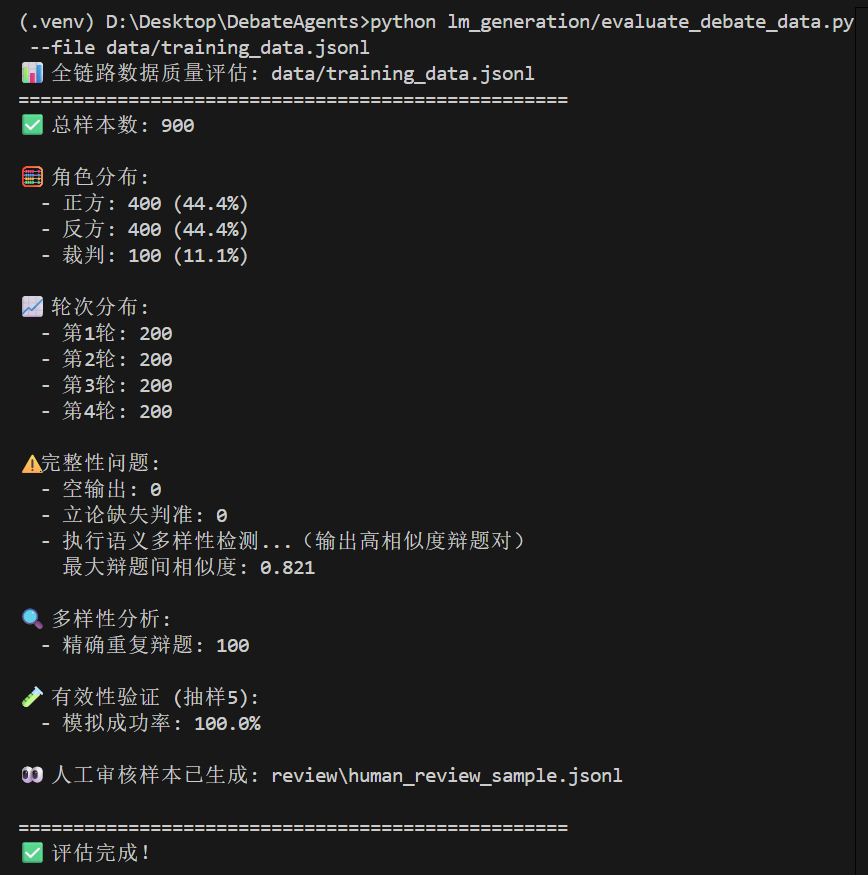

# DebateAgent

## datasets
数据集构建位于`datasets`目录下。

|文件名|说明|
|---|---|
|`training_data_fixed.jsonl`|qwen3-max生成的辩论数据|
|`debate_dataset_v2.jsonl`|gemini-2.5-pro生成的辩论数据|
|`logic_critique_dataset.jsonl`|gemini-2.5flash生成的逻辑诊断数据|
|`unified_training_data.jsonl`|最终合并训练数据|
|`topic.py`|辩题生成程序|
|`topic.jsonl`|辩题汇总|
|`wrong.py`|用于生成逻辑判断数据|


## training
训练代码位于`train`目录下。

`train.py`主训练函数。

`merge.py`将lora微调的部分与主权重融合。
## inference
内含多个版本，主要区别在于轮数和prompt，用于验证输入时的prompt对辩论内容质量的影响。
## eval
评估代码，掉用google-api使用gemini进行模型评估脚本。请手动设置api-key。

内含实例的微调和基线在*钱是万恶之源*等五个辩题上进行辩论的评分log。
## front
该目录下是前端模块。

## 大模型高质量数据生成文档说明
### 一、大模型数据采集全流程
1. 概览：使用大模型qwen3-max；生成辩题100条；python版本3.10.11；原始数据为 seed_debates.jsonl 文件，处理后数据为 training_data.jsonl 文件。前者比后者实际信息更多，但只提取了关键部分，如果想获取更详细的输入语料可更改lm_generation/convert_seed_to_training.py 文件并重新运行。

2. 使用流程：【全部在根目录下运行】

- 设置 API key（Windows cmd）:
```
set DASHSCOPE_API_KEY=sk-你的真实密钥
```
- 安装依赖（建议在虚拟环境中，且不保证version全都正确且模块一定必要）:
```
pip install -r requirements.txt
```
- 清洗手动输入的题目
```
python lm_generation/evaluate_topics.py
```
- 生成种子(其实是所有)数据（生成几条在generate_debate_topics中定义，正反方反驳轮数在main的参数里）:
```
python lm_generation\generate_seed_data.py
```
- 转为训练格式
```
python lm_generation/convert_seed_to_training.py
```
- 数据评估
```
python lm_generation/evaluate_debate_data.py --file data/training_data.jsonl
```

### 二、数据质量评估项详细
- 总样本数
统计输入文件中共有多少条辩论数据样本，是所有评估的基础数量指标。
- 角色分布
分析每条样本对应的角色类型（正方、反方、裁判或其他），检查三类角色是否均衡覆盖，避免某一方数据缺失。
- 轮次分布
统计各轮次（如第1轮立论、第2轮驳论等）的数据量，确保多轮辩论结构完整，尤其关注第1轮是否充足。
- 空输出问题
检查是否存在模型输出为空字符串的样本，这类数据无效，会影响训练效果。
- 立论缺失判准
针对正方或反方的立论（第1轮）样本，检查其输出中是否包含“判准”关键词（如【判准】或[判准]），这是辩论逻辑的核心要素，缺失说明内容不完整。
- 精确重复辩题
统计完全相同的辩题出现次数，重复辩题会降低数据多样性，影响模型泛化能力。
- 高相似度辩题对
利用语义向量计算辩题之间的相似度，识别虽文字不同但含义高度接近的辩题（相似度 > 0.85），防止表面多样实则冗余。
- 有效性验证（模拟成功率）
随机抽取部分样本，用本地轻量模型（如 Qwen/Qwen1.5-1.8B）重新生成响应，检验是否能产出合理长度的非空内容，以此间接评估原始数据的可学习性和合理性。
- 人工审核样本生成
自动抽取30条代表性样本保存到 review/human_review_sample.jsonl，供人工抽查内容质量、逻辑连贯性与格式规范性。



本次对包含 100 个辩题、共计 900 条样本的辩论训练数据进行了全链路质量评估。评估结果显示，该数据集整体质量较高，结构完整，格式规范，具备良好的训练适用性。

数据总量为 900 条，其中正方与反方发言各占 400 条（合计 88.8%），裁判点评 100 条（11.1%），角色分布均衡。轮次分布显示，第 1 至第 4 轮发言各为 200 条，表明每个辩题均完整覆盖立论、三轮交锋及裁判总结，无缺失或截断情况。

完整性检查未发现任何空输出或格式错误，所有立论样本均包含“判准”要素，说明生成过程严格遵循了预设模板，数据一致性良好。有效性验证通过轻量模型对 6 条上下文样本进行模拟生成，成功率达 100%，表明数据指令清晰、上下文连贯，能够被模型有效理解与响应。

在多样性方面，系统检测到 100 次“精确重复辩题”，但这属于正常现象——每个辩题分别对应正方和反方的立论，因此同一辩题出现两次。实际唯一辩题数量为 100 个，若这些辩题覆盖科技、伦理、教育、社会政策等多个领域，则具备较好的主题广度。

经语义嵌入分析，100 个辩题两两间最大余弦相似度为 0.821，没有超过0.85的高相似度辩题对，表明主题分布广泛，无语义冗余。

此外，系统已自动生成包含 30 条样本的人工审核文件（review/human_review_sample.jsonl），建议结合人工抽查，重点评估论点逻辑性、反驳针对性及裁判总结的公正性与深度。

综上所述，该数据集结构严谨、内容完整、格式统一，虽辩题数量属中等规模，但质量上乘，非常适合作为指令微调（SFT）的基础数据，用于训练具备基本辩论能力的语言模型。未来可考虑在保持高质量的前提下，进一步扩充辩题数量以提升模型泛化能力。
